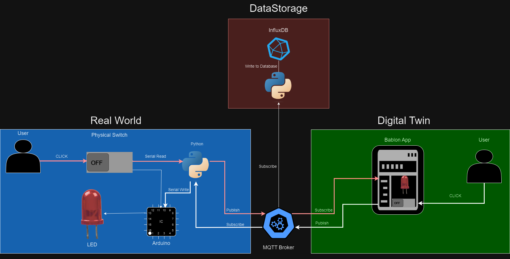

# Digital Twin Platform
This was developed because the existing AWS digital twin eco-system

## Issues with AWS Digital Twin
- Platform was slow, resulting in 4 second delays
- Did not support bi-directional interaction within the digital twin

##  Tech
- Babylon.js - (HTML, CSS, JS)
- MQTT (eclipse-mosquitto) with docker
- arduino uno with python serial communication

## Architecture 


## Deployment for Windows (Assuming you already have docker)
1)  ### Backend
    This will setup and configure influxDB and the MQTT Broker.
    ```
    cd backend
    docker-compose up 
    
    # For more info on deploying MQTT and Influxdb checkout:
    # https://hub.docker.com/_/influxdb
    # https://github.com/sukesh-ak/setup-mosquitto-with-docker
    ```
 
2)  ### Digital Twin UI
    This is a pure HTML CSS JS application with the use of a couple javascript library.  No resources is needed to run this.  Simply open digital_twin_ui/digital_twin.html in the browser.


3) ### Virtual Enviroment For MQTT Clients
    This Virtual environment will be used to:
    - Run the python serial code that communicates with the arduino.  
    - Listen for new messages when published by the MQTT broker so it can store it in the InfluxDB database.
    ```
    python -m venv client_env
    client_env\Scripts\activate
    pip install pyserial  
    pip install paho-mqtt
    ``` 

4) ### Arduino Setup
    You need to do 2 things to setup the arduino:
    1. Use arduino IDE to import the code unto the arduino,  The code to import is called /arduino_code/main_arduino.ino
    2. You need to run the python serial code.  This will listen for changes on the MQTT broker and it will also be used to publish changes on the MQTT broker.  When changes are made on the MQTT broker, the python serial code will command the arduino.  
        ```To run this, you must run the python arduino_code/mqtt_led_serial.py```
